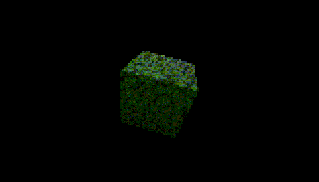
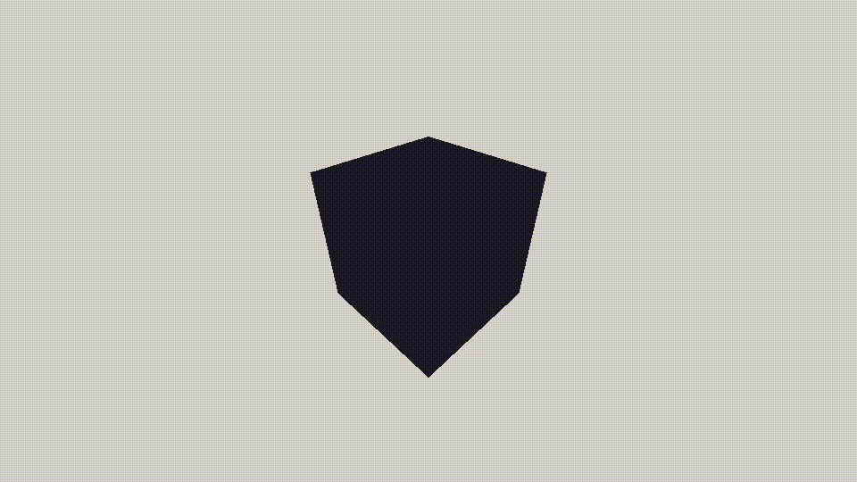
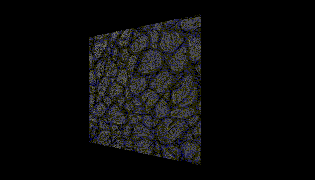
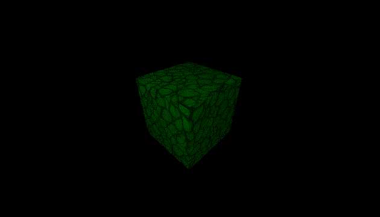

# alasgar
alasgar is a pure nim game engine based on OpenGL. The main reason to start developing a new game engine, was to learn graphics programming (first challenge) using nim programming language (second challenge). You can write the whole game logic and also shaders in nim. It supports a few platforms including mobile, web, and desktop. It performs well in the performance tests. It is the journey of a backend/system developer through graphics/game programming.

# Platforms
 - Linux
 - Windows
 - Android
 - WebAssembly
 - Mac (work in progress)
 - iOS (not supoorted)

## Experimental game engine
alasgar is a basic game engine, and it is limited, so it is not ready for production use.

## nimx and vmath
Most of nimx build system has been copied here, just removed and reformed some parts. This part will be rewritten later to use nimble instead of nake. nimx is a UI library (and game framework) for nim, check it out [here](https://github.com/yglukhov/nimx). 

For game mathematics, vmath is used. vmath has a good convention, check it out for more information [here](https://github.com/treeform/vmath). 

## Installation
```bash
nimble install alasgar
```
or simply the latest version:
```bash
nimble install https://github.com/abisxir/alasgar
```

## Quick start
```bash
git clone https://github.com/abisxir/alasgar.git
cd alasgar/examples
nim c -r hello.nim
```

Table of Contents
=================

* [Window and scene creation](#window-and-scene-creation)  
* [Change background color](#background)  
* [First mesh](#first-mesh)  
* [Point light](#point-light)
* [Scripts](#scripts)
* [Rotation and transform](#rotation)
* [Material](#material)
* [Texture](#texture)
* [More lights](#more-lights)
* [Access components](#access-components)
* [Screen size](#screen-size)
* [Environment variables](#environment-variables)
* [Normal maps](#normal-maps)
* [Interactive objects](#interactive-objects)
* [Shadows](#shadows)
* [Effects](#effects)
* [Custom effects](#custom-effects)
* [Shaders](#shaders)

Window and scene creation
=========================
```nim
import alasgar

# Creates a window named Hello
window("Hello", 960, 540)
   
# Creates a new scene
let scene = newScene()

# Creates camera entity
let cameraEntity = newEntity(scene, "Camera")
# Sets camera position
cameraEntity.transform.position = vec3(5, 5, 5)
# Adds a perspective camera component to entity
addComponent(
    cameraEntity, 
    newPerspectiveCamera(
        75, 
        runtime.ratio, 
        0.1, 
        100.0, 
        vec3(0) - cameraEntity.transform.position
    )
)
# Makes the camera entity child of the scene
addChild(scene, cameraEntity)

# Renders an empty sceene
render(scene)
# Runs game main loop
loop()
```

As you see, we instantiate a scene, add a camera to that, and render the created scene. If everything goes right, you will see an empty window with the given size. Run it using the nim compiler:

```bash
nim c -r main.nim
```

Check the [example](https://abisxir.github.io/alasgar/step1/build) here.

When you create a window by defult it runs in window mode, you can easily enable fullscreen mode:
```nim
# Creates a window named Hello and enables fullscreen mode.
window("Hello", 960, 540, fullscreen=true)
```

Let us add a cube to our scene, but to see the cube, it is better if we give a brighter background to our window, it will make it easier to see our meshes before we add lights. To set the background color, we need to introduce the environment component:

Background
==========
```nim
...
let 
    # Creates a new scene
    scene = newScene()
    # Creates an environment component
    env = newEnvironmentComponent()

# Sets background color
setBackground(env, parseHex("d7d1bf"))
# Adds environment component to scene
addComponent(scene, env)
...
```

That was all you need to do. If you compile and execute it, you will see an empty window with a slightly better [color](https://abisxir.github.io/alasgar/step2/build).


First mesh
==========
```nim
...

# Creates cube entity, by default position is 0, 0, 0
let cubeEntity = newEntity(scene, "Cube")
# Add a cube mesh component to entity
addComponent(cubeEntity, newCubeMesh())
# Makes the cube enity child of the scene
addChild(scene, cubeEntity)
# Scale it up
cubeEntity.transform.scale = vec3(2)

...
```

When you execute the program, you will see an ugly black [cube](https://abisxir.github.io/alasgar/step3/build). As you guess we need to have a light in our scene so let us add a point light to our scene:

Point light
===========
```nim
...

# Creates light entity
let lightEntity = newEntity(scene, "Light")
# Sets light position
lightEntity.transform.position = vec3(-5, 5, 5)
# Adds a point light component to entity
addComponent(
    lightEntity, 
    newPointLightComponent()
)
# Makes the light entity child of the scene
addChild(scene, lightEntity)

...
```

That is all we needed, our ugly cube maybe is [less ugly](https://abisxir.github.io/alasgar/step4/build) now. Lights have some properties, like color, luminance, etc. You change it and you will shade the cube differently.

Scripts
=======
To program an entity, we need to add a ScriptComponent to our light entity. Each component has access to an entity, the entity's transform, and the component's data. We can add a script to any entity using the "program" function or directly by instantiating a ScriptComponent using the "newScriptComponent" function.

```nim
...

# Creates light entity
let lightEntity = newEntity(scene, "Light")
# Adds a point light component to entity
addComponent(
    lightEntity, 
    newPointLightComponent()
)
# Adds a script component to light entity
program(lightEntity, proc(script: ScriptComponent) =
    const r = 7.0 
    # Change position on transform
    script.transform.position = r * vec3(
        sin(runtime.age),
        cos(runtime.age),
        sin(runtime.age) * cos(runtime.age),
    )
)
# Makes the light entity child of the scene
addChild(scene, lightEntity)

...
```


[See](https://abisxir.github.io/alasgar/step5/build) now our light moves around our scene and lights our cube from different directions. As you see in the source code, we used an anonymous function to change light's position. You can define a function and use that here. Feel free to play with nim features. As you notice, we directly access transform component from script component. Each entity has a  reference to the transform component, and all entity components have a reference to that.
In the script we used runtime variable, it is a readonly variable that gives us some good information about engine, also has an instance to engine inside it:

```nim
type 
    Runtime = object
        engine: Engine   # engine instance
        age: float32     # total seconds engine is running
        frames: int      # total frames rendered
        fps: float32     # current fps
        delta: float32   # delta between last two frames
        input: Input     # last input state
        ratio: float32   # screen ratio
        windowSize: Vec2 # window size
        screenSize: Vec2 # screen size

```

Rotation
========
Let us rotate the cube. To do that we need a script component attached to the cube entity:

```nim
...

# Adds a script component to cube entity, we use this helpful function:
program(cubeEntity, proc(script: ScriptComponent) =
    # We can rotate an object using euler also it is possible to directly set rotation property which is a quaternion.
    script.transform.euler = vec3(
        sin(runtime.age) * cos(runtime.age), 
        cos(runtime.age), 
        sin(runtime.age)
    )
)

...
```
As you [see](https://abisxir.github.io/alasgar/step6/build) our ugly cube is rotating and we used Euler angles to change rotation. But also rotation as quat is enabled in TransformComponent and you can use it if you are looking for troubles. Transform component has some useful functions and properties:

```nim
type
    TransformComponent = ref object of RootObj
        position: Vec3              # position in local space
        scale: Vec3                 # scale in local space
        rotation: Quat              # rotation in local space
        euler: Vec3                 # write only euler angles in local space
        globalPosition: Vec3        # position in global space
        globalScale: Vec3           # scale in global space
        globalRotation: Quat        # rotation in global space
        parent: TransformComponent  # parent transform, read only

proc lookAt*(t: TransformComponent, target: Vec3)
proc lookAt*(t: TransformComponent, target: TransformComponent)

```


Material
========
We can change the cube color using material components. So what we need is to add a material component to define the cube's material.
I used the chroma library to manipulate colors, it is a great library, [here](https://abisxir.github.io/alasgar/step7/build) you can see how to use it.

```nim
...

# Adds a material to cube
addComponent(cubeEntity, newMaterialComponent(diffuseColor=parseHtmlName("Tomato")))

...
```
Material component in alasgar is instantiated using "newMaterialComponent" that accepts these parameters:
```nim
func newMaterialComponent*(diffuseColor: Color=COLOR_WHITE, 
                           specularColor: Color=COLOR_WHITE, 
                           emissiveColor: Color=COLOR_BLACK,
                           albedoMap, 
                           normalMap, 
                           metallicMap, 
                           roughnessMap, 
                           aoMap, 
                           emissiveMap: Texture = nil, 
                           metallic: float32 = 0.0,
                           roughness: float32 = 0.0,
                           reflectance: float32 = 0.0,
                           shininess: float32 = 128.0,
                           ao: float32 = 1.0,
                           frame: int=0,
                           vframes: int=1,
                           hframes: int=1,
                           castShadow: bool=false)
```
If roughness and metallic factors are zero also there is no metallic map and roughness map provided then the shader will use shininess and shades with phong model otherwise will be PBR. vfames, hframes, and frame is used to offset texture, very helpful for sprites or animations, will discuss it later in the sprites section.

Texture
=======
It is time to give texture to our cube. To make it multi-platform you need to make "res" folder in your project root and copy your assets inside.
The assets are accessible using a relative path by res like "res://stone-texture.png". It applies to all other assets like obj files or audio files.

```nim
...

# Adds a material to cube
addComponent(cubeEntity, newMaterialComponent(
    diffuseColor=parseHtmlName("white"),
    specularColor=parseHtmlName("grey"),
    albedoMap=newTexture("res://stone-texture.png")
))

...
```
If you run the sample, you will see a [textured](https://abisxir.github.io/alasgar/step8/build) cube which is not that much ugly this time but there are a lot to improve.

The texture used here grabbed from: https://opengameart.org/content/handpainted-stone-floor-texture

More lights
===========
As you see our scene has just one light and the light is moving. Let us add a new light to try another type of lights:

```nim
...

# Creats spot point light entity
let spotLightEntity = newEntity(scene, "SpotLight")
# Sets position to (-6, 6, 6)
spotLightEntity.transform.position = vec3(-6, 6, 6)
# Adds a spot point light component
addComponent(spotLightEntity, newSpotPointLightComponent(
    vec3(0) - spotLightEntity.transform.position, # Light direction
    color=parseHtmlName("Tomato")                 # Light color
    luminance=100.0                               # Luminance amount
    shadow=false,                                 # Casts shadow or not
    innerCutoff=30,                               # Inner circle of light
    outerCutoff=90                                # Outer circle of light
))
# Makes the new light child of the scene
addChild(scene, spotLightEntity)

# Creats direct light entity
let directLightEntity = newEntity(scene, "DirectLight")
# Adds a direct light component, and select camera direction for lighting
addComponent(directLightEntity, newDirectLightComponent(
    vec3(0) - cameraEntity.transform.position,    # Light direction
    color=parseHtmlName("Aqua"),                  # Light color
    luminance=150.0,                              # Light intensity
    shadow=false,                                 # Casts shadow or not
))
# Makes the new light child of the scene
addChild(scene, directLightEntity)

...
```
As you [see](https://abisxir.github.io/alasgar/step9/build) now, our cube is shaded by three different kinds of lights, not that much ugly anymore. However, our scene with just one cube is boring. Before we add another objects to our scene, let us see how we can access components when we program an entity.


Access components
=================
Let us program the direct light's entity and access to the direct light's component and just for fun change the light color and luminance. To access a component we can call getComponent[T] on an entity or a component. Also, it is possible to access it using the index operator on any entity or component:

```nim
let c = getComponent[MyComponent](e)
```

Or simply using an index operator:

```nim
let c = e[MyComponent]
```

If there is no such a component, it will return nil. Let us try it by adding a script component to our spot light to program it:

```nim
...

# Adds a script component to direct light entity
program(directLightEntity, proc(script: ScriptComponent) =
    # Access to direct light component.
    let light = script[DirectLightComponent]
    # Or you can access it by calling getComponent function:
    # let light = getComponent[DirectLightComponent](script)
    # Changes light color
    light.color = color(
        abs(sin(runtime.age)), 
        abs(cos(runtime.age)), 
        abs(sin(runtime.age) * cos(runtime.age))
    )
    # Change luminance, will be between 250 and 750
    light.luminance = 500.0 + 250.0 * sin(runtime.age)
)

...
```
If you [execute](https://abisxir.github.io/alasgar/step10/build) the program, you will notice that the color is changing.

Screen size
===========
By default the screen size is equal with window size, but maybe you like to have a lower resolution:
```nim
import alasgar

# Creates a window named Hello, and sets screen size to (160, 90)
screen(160, 90)
window("Hello", 640, 360)

...   
```

You need to specify it before creating window, after window creation there is no effect when setting the screen size.

Environment variables
=====================
We already used envionment variable to change background color. We can set these attributes:
    - Background color
    - Fog
    - Ambient light color
    - Skybox

```nim
# Sets background color
func setBackground(env: EnvironmentComponent, color: Color) 
# Sets ambient light color
func setAmbient(env: EnvironmentComponent, color: Color, intense: float32)
# Sets fog density
func setFogDensity(env: EnvironmentComponent, density: float32)
# Sets fog gradient
func setFogGradient(env: EnvironmentComponent, gradient: float32) 
# Sets skybox, for each side totally 6 images
func setSkybox(env: EnvironmentComponent, px, nx, py, ny, pz, nz: string, size: int) 
# Sets skybox, takes panroma image and converts it to a cube box texture, accepts hdr images
func setSkybox(env: EnvironmentComponent, url: string, size: int)
# Sets environment intensity, for IBL
func setEnvironmentIntensity(env: EnvironmentComponent, value: float32)
# Sets envirnoment blurrity, the higher it gets, skybox will get much blur 
func setEnvironmentBlurrity(env: EnvironmentComponent, value: float32)
```

We will discuss postprocessing effects later on a dedicated section. You can see and example of environment variables in shadows section.


Normal maps
===========
It is easy to add a normal map, we need to specify it in material component:

```nim
...

# Adds a material to cube
addComponent(cubeEntity, 
    newMaterialComponent(
        diffuseColor=parseHtmlName("white"),
        albedoMap=newTexture("res://stone-texture.png"),
        normalMap=newTexture("res://stone-texture-normal.png")
    )
)
# Makes the cube enity child of scene
addChild(scene, cubeEntity)

...
```



See normal sample [here](examples/normal.nim).


Interactive objects
===================

It is nice if we can select an object with mouse or by touch on mobile platforms, let us add a InteractiveComponent to our cube:

```nim
...

# Handles mouse hover in
proc onCubeHover(interactive: InteractiveComponent, collision: Collision)=
    let material = interactive[MaterialComponent]
    material.diffuseColor = parseHtmlName("yellow")

# Handles mouse hover out
proc onCubeOut(interactive: InteractiveComponent)=
    let material = interactive[MaterialComponent]
    material.diffuseColor = parseHtmlName("green")

# Creates cube entity, by default position is 0, 0, 0
var cubeEntity = newEntity(scene, "Cube")
# Set scale to 2
cubeEntity.transform.scale = vec3(2)
# Add a cube mesh component to entity
addComponent(cubeEntity, newCubeMesh())
# Adds a material to cube
addComponent(cubeEntity, 
    newMaterialComponent(
        diffuseColor=parseHtmlName("green")
    )
)
# Adds a collision compnent to cube entity
addComponent(cubeEntity, newCollisionComponent(vec3(-1, -1, -1), vec3(1, 1, 1)))
# Adds an interactive
addComponent(
    cubeEntity, 
    newInteractiveComponent(
        onHover=onCubeHover,
        onOut=onCubeOut
    )
)
# Makes the cube enity child of scene
addChild(scene, cubeEntity)

...
```

As you see, we have two functions to handle mouse's in and out (hover) functionalities. To make interactive components working, you need to add a collision component.
Alsgar supports just two types, AABB and sphere. We also changed the spot light position, stopped point light moving and set our cube diffuse color to green. It is the final result:



When you add interactive component, you have: onPress, onRelease, onHover, onOut and onMotion. Except onOut, all of the functions pass collision information.

See interactive sample [here](examples/interactive.nim).


Shadows
=======

For now, shadows are just implemented for SpotPointLight components, also it is limited to just one light.
Let us setup our scene in a way that we can observe shadows, after setup window, scene and setting up our camera, we create a big platform:

```nim
...

# Creates platform entity, by default position is (0, 0, 0)
var platformEntity = newEntity(scene, "Platform")
# Set scale to 20
platformEntity.transform.scale = vec3(20)
platformEntity.transform.euler = vec3(0, 0, -PI / 2)
# Add a cube mesh component to entity
addComponent(platformEntity, newPlaneMesh(1, 1))
# Adds a material to cube
addComponent(
    platformEntity, 
    newMaterialComponent(
        diffuseColor=parseHtmlName("grey"),
    )
)
# Makes the cube enity child of scene
addChild(scene, platformEntity)

...
```

As you see we created a plane mesh and scaled it to 20, and we rotated it as we want to see it from top. Then we make a simple function to add cubes, we need two cubes so this is our function:

```nim
...

proc createCube(name: string, position: Vec3) =
    # Creates cube entity
    var cubeEntity = newEntity(scene, name)
    # Positions cube to (0, 2, 0)
    cubeEntity.transform.position = position
    # Add a cube mesh component to entity
    addComponent(cubeEntity, newCubeMesh())
    # Adds a script component to cube entity
    addComponent(cubeEntity, newScriptComponent(proc(script: ScriptComponent, input: Input, delta: float32) =
        # We can rotate an object using euler also we can directly set rotation property that is a quaternion.
        script.transform.euler = vec3(
            runtime.engine.age * 0.1, 
            runtime.engine.age * 0.3, 
            runtime.engine.age * 0.2,
        )
    ))
    # Adds a material to cube and specifies that the cube casts shadow.
    addComponent(
        cubeEntity, 
        newMaterialComponent(
            diffuseColor=parseHtmlName("grey"),
            castShadow=true,                    # Here we specify that this object casts shadow, default is false
        )
    )
    # Makes the cube enity child of scene
    addChild(scene, cubeEntity)


createCube("Cube1", vec3(1, 4, 0))
createCube("Cube2", vec3(-4, 2, 0))

...
```

As you see, we created two cubes in different positions. The important part is that we need to define in object material that it casts shadow.
Now we create a spot light component and we need to enable shadow for this light source:

```nim
...

# Creats spot point light entity
var spotLightEntity = newEntity(scene, "SpotLight")
# Sets position to (-6, 6, 6)
spotLightEntity.transform.position = vec3(12, 12, 0)
# Adds a spot point light component
addComponent(spotLightEntity, newSpotPointLightComponent(
    vec3(0) - spotLightEntity.transform.position, # Light direction
    color=parseHtmlName("LemonChiffon"),          # Light color
    shadow=true,                                  # Enables shadow
    innerCutoff=30,                               # Inner circle of light
    outerCutoff=90                                # Outer circle of light
    )
)
# Makes the new light child of the scene
addChild(scene, spotLightEntity)

...
```


That is all, if you run shadow sample you will see the effects. I hope you also notice the artifacts, light bleeding and so on, I like them :)
Here I used variance shadow map, but this part needs many improvements specially batching is not enabled for shadow casting objects so the performance is not going to be satisfying. There are going to be many improvements in near future.

See shadow sample [here](examples/shadow.nim).

Effects
=======

There are some effects already developed to use in alasgar:
 - FXAA
 - SSAO
 - HBAO
 - Bloom

To use them we need to import and add it to camera as a post processing effect:

```nim
...
import alasgar/private/effects/fxaa

...
# Creates camera entity
var 
    cameraEntity = newEntity(scene, "Camera")

# Sets camera position
cameraEntity.transform.position = vec3(-5, 4, -5)

# Creates a camera component to later add it to camera entity
let 
    camera = newPerspectiveCamera(
        75, 
        runtime.ratio, 
        0.1, 
        100.0, 
        vec3(0) - cameraEntity.transform.position
    )

# Adds fxaa effect
addEffect(camera, "FXAA", newFXAAEffect())

# Adds a perspective camera component to entity
addComponent(
    cameraEntity, 
    camera,
)

# Makes the camera entity child of scene
addChild(scene, cameraEntity)

...
```

This effects come with some parameters to adjust the result. Also you can write custom effects if you like. There are some functions to manipulate effects:
 - removeEffect(c: CamereEntity, name: string)
 - disableEffect(c: CamereEntity, name: string)
 - enableEffect(c: CamereEntity, name: string)
 - getEffect(c: CamereEntity, name: string): Shader

# Custom effects
Adding post processing effect or custom effect is as easy as writing a glsl function. Predefined effects like bloom or FXAA are also custom effect that just provided to make it accessable for most of the use-cases. So what we need is a camera:

```nim
...
import alasgar/private/effects/fxaa

...
# Creates camera entity
var 
    cameraEntity = newEntity(scene, "Camera")

# Sets camera position
cameraEntity.transform.position = vec3(-5, 4, -5)

# Creates a camera component to later add it to camera entity
let 
    camera = newPerspectiveCamera(
        75, 
        runtime.ratio, 
        0.1, 
        100.0, 
        vec3(0) - cameraEntity.transform.position
    )

# Adds custom effect
addEffect(camera, "MY-EFFECT", """
void fragment() {
    COLOR.r = 1.0;
}
""")

# Adds a perspective camera component to entity
addComponent(
    cameraEntity, 
    camera,
)

# Makes the camera entity child of scene
addChild(scene, cameraEntity)

...
```

As you see we just set the red channel to 1.0, you can run and see how it works. Unfortunately alasgar is not mature to provide a compiling feature on adding effects, so you will get error if your function has any error. But there some good libraries for nim, like shady. Maybe someday it is integerated into alasgar. Back to the main topic, there are some variables provided here:

 - vec2 UV: readonly
 - vec4 COLOR: read/write
 - frame: readonly
 - camera: readonly

Frame definition:

struct {
  vec3 resolution;
  float time;
  float time_delta;
  float frame;
  vec4 mouse;
  vec4 date;
}

Camera definition:

struct {
  vec3 position;
  mat4 view;
  mat4 view_inversed;
  mat4 projection;
  mat4 projection_inversed;
  float exposure;
  float gamma;
  float near;
  float far;
}

There are also some function available like:

 - vec4 get_color(vec2)
 - vec3 get_normal(vec2)
 - vec3 get_position(vec2)
 - float snoise(vec2)

The post-processing effect is a simple shader, so you can define your functions, variable and uniforms. Let us try to pass a uniform variable:

```nim
...
# Adds custom effect
addEffect(camera, "MY-EFFECT", """

uniform vec3 u_add; 

void fragment() {
    COLOR.rgb += u_add;
}
""")

# Adds a perspective camera component to entity
addComponent(
    cameraEntity, 
    camera,
)
# Adds a script component to control camera effect
addComponent(cameraEntity, newScriptComponent(proc(script: ScriptComponent, input: Input, delta: float32) =
    # Access to camera component and get our effect.
    let effect = getEffect(script[CameraEntity], "MY-EFFECT")
    # Shader will keep this value and before render will pass it to gpu.
    set(effect, "u_add", delta * vec3(0.9, 0.7, 0.5))
))

# Makes the camera entity child of scene
addChild(scene, cameraEntity)

...
```

Predefined textures are limited to 4 channels:

 - channel0
 - channel1
 - channel2
 - channel3

They are exactly like uniform values but predefined so to set it we will need a texture:

```nim
...
# Adds custom effect
addEffect(camera, "MY-EFFECT", """
void fragment() {
    COLOR.rgb *= texture(channel0, UV);
}
""")

# Create a texture
let texture = newTexture("res://stone-texture.png")
# Gets effect instance that is a shader
let effect = getEffect(camera, "MY-EFFECT")
# Attachs the texture to channel0
set(effect, "channel0", texture, 0)

# Adds a perspective camera component to entity
addComponent(
    cameraEntity, 
    camera,
)

# Makes the camera entity child of scene
addChild(scene, cameraEntity)

...
```

If you like a different sampler like cube or you need extra samples you can still define them but you should start binding them from slot 8:

```nim
...
# Adds custom effect
addEffect(camera, "MY-EFFECT", """

layout(binding = 8) uniform sampler2D my_channel;

void fragment() {
    ...
}
""")

# Create a texture
let texture = newTexture("res://stone-texture.png")
# Gets effect instance that is a shader
let effect = getEffect(camera, "MY-EFFECT")
# Attachs the texture to my_channel at slot 8
set(effect, "my_channel", texture, 8)

```

Shaders
=======
It is easy to define to customize the way that one mesh renders. However it needs to be used just in case that the default shader cannot do it. As each shader has it's own parameters and switching between shader when rendering will come with big performance cost when there a lot of meshes with custom shader.
Adding a fragment shader to a mesh is possible using ShaderComponent:

```nim
...

# Creates cube entity, by default position is 0, 0, 0
var cubeEntity = newEntity(scene, "Cube")
# Set scale to 2
cubeEntity.transform.scale = vec3(2)
# Add a cube mesh component to entity
addComponent(cubeEntity, newCubeMesh())
# Adds a material to cube
addComponent(cubeEntity, 
    newMaterialComponent(
        diffuseColor=parseHtmlName("green")
    )
)
# Adds a shader component
addComponent(
    cubeEntity, 
    newFragmentShaderComponent("""
    void fragment() {
        COLOR.g = 0.0;
    }
""")
)
# Makes the cube enity child of scene
addChild(scene, cubeEntity)

...
```

As you see, we deleted the green channel from color.