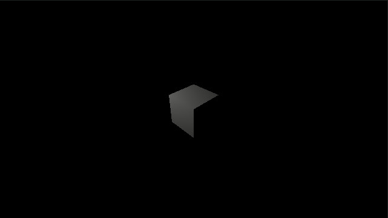
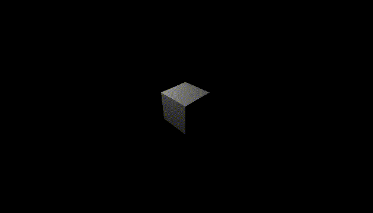
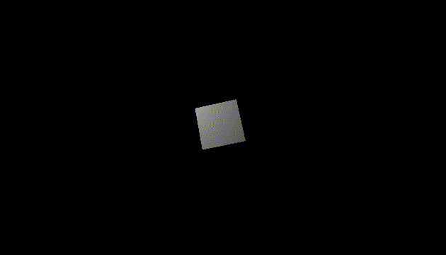
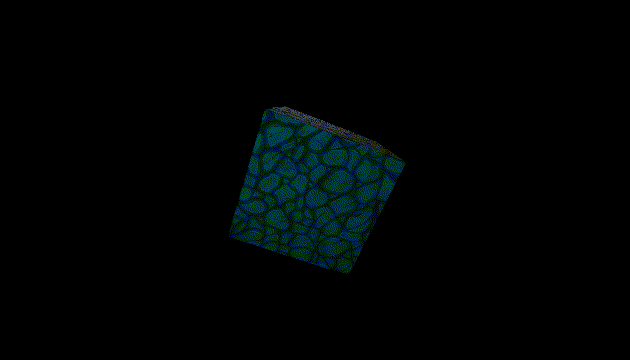
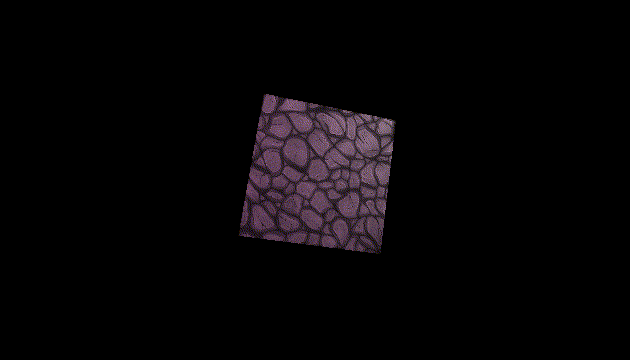

# alasgar
Alasgar is a pure nim game engine based on OpenGL ES. The reason behind it was to learn graphic programming using nim programming language.

# Platforms
 - Linux
 - Windows
 - Android
 - Web (work in progress)
 - Mac (work in progress)
 - iOS (not supoorted)

## Experimental game engine
This is a basic game engine, and it is also too much limited so it is not ready for production use.

## nimx and vmath
I copied most of nimx build system here, just removed and reformed some parts. I will rewrite this part later to use nimble instead of nake. nimx is a UI library (and game framework) for nim, check it out here: https://github.com/yglukhov/nimx

Also most of math stuff copied from vmath: https://github.com/treeform/vmath

## Installation
```bash
nimble install https://github.com/abisxir/alasgar
```

## Quick start
```bash
git clone https://github.com/abisxir/alasgar.git
cd alasgar/examples
nim c -r hello.nim
```

Table of Contents
=================

* [Window and scene creation](#window-and-scene-creation)  
* [First mesh](#first-mesh)  
* [Point light](#point-light)
* [Scripts](#scripts)
* [Rotation](#rotation)
* [Material](#material)
* [Texture](#texture)
* [More lights](#more-lights)
* [Access components](#access-components)
* [Screen size](#screen-size)
* [Normal maps](#normal-maps)
* [Interactive objects](#interactive-objects)
* [Environment variables](#environment-variables)
* [Shadows](#shadows)

Window and scene creation
=========================
```nim
import alasgar

# Creates a window named Hello
window("Hello", 640, 360)
   
# Creates a new scene
var scene = newScene()

# Creates camera entity
var cameraEntity = newEntity(scene, "Camera")
# Sets camera position
cameraEntity.transform.position = vec3(5, 5, 5)
# Adds a perspective camera component to entity
addComponent(
    cameraEntity, 
    newPerspectiveCamera(
        75, 
        engine.ratio, 
        0.1, 
        100.0, 
        vec3(0) - cameraEntity.transform.position
    )
)
# Makes the camera entity child of the scene
addChild(scene, cameraEntity)

# Renders an empty sceene
render(scene)
# Runs game main loop
loop()
```

As you see, we instantiate a scene, add a camera to it and we render the created scene.
If everything was right, you will see an empty window with the given size. Run it using nim compiler:

```bash
nim c -r main.nim
```

When you create a window by defult it runs in window mode, you can easily enable fullscreen mode:
```nim
# Creates a window named Hello and enables fullscreen mode.
window("Hello", 640, 360, fullscreen=true)
```

Let us add a cube to our scene.


First mesh
==========
```nim
...

# Creates cube entity, by default position is 0, 0, 0
var cubeEntity = newEntity(scene, "Cube")
# Add a cube mesh component to entity
addComponent(cubeEntity, newCubeMesh())
# Makes the cube enity child of the scene
addChild(scene, cubeEntity)

...
```

When you run the game barely you can see the cube, as you guess we need to have a light in our scene, let us add a point light to our scene:

Point light
===========
```nim
...

# Creates light entity
var lightEntity = newEntity(scene, "Light")
# Sets light position
lightEntity.transform.position = vec3(-5, 5, 5)
# Adds a point light component to entity
addComponent(
    lightEntity, 
    newPointLightComponent()
)
# Makes the light entity child of the scene
addChild(scene, lightEntity)

...
```



When you run the code, you will see an ugly grey cube. Let us move the light:


Scripts
=======
To program an entity, we need to add a ScriptComponent to our light entity. Each component has access to entity, entity's transform and component's data.

```nim
...

# Creates light entity
var lightEntity = newEntity(scene, "Light")
# Sets light position
lightEntity.transform.position = vec3(-5, 5, 5)
# Adds a point light component to entity
addComponent(
    lightEntity, 
    newPointLightComponent()
)
# Adds a script component to light entity
addComponent(lightEntity, newScriptComponent(proc(script: ScriptComponent, input: Input, delta: float32) =
    const r = 5 
    # Change position on transform
    script.transform.positionX = r * sin(engine.age) 
    script.transform.positionZ = r * cos(engine.age)
))
# Makes the light entity child of the scene
addChild(scene, lightEntity)

...
```



If you run the code, light is going to move around the cube. As you see in the code we used a anonymous function to change light's position.
You can define a function and use it, here. Feel free to play with nim features.


Rotation
========
Let us rotate the cube. To do it we need a script component attached to cube entity:

```nim
...

# Creates cube entity, by default position is 0, 0, 0
var cubeEntity = newEntity(scene, "Cube")
# Add a cube mesh component to entity
addComponent(cubeEntity, newCubeMesh())
# Adds a script component to cube entity
addComponent(cubeEntity, newScriptComponent(proc(script: ScriptComponent, input: Input, delta: float32) =
    # We can rotate an object using euler also we can directly set rotation property that is a quaternion.
    script.transform.euler = vec3(
        sin(engine.age) * sin(engine.age), 
        cos(engine.age), 
        sin(engine.age)
    )
))# Makes the cube enity child of the scene
addChild(scene, cubeEntity)

...
```




Material
========
We can change cube color using material components. We scale cube and make it bigger and then we add a component to define cube material.
I used chroma library to manipulate colors, it is a great library, check here to see how to use it:
https://github.com/treeform/chroma

```nim
...

# Creates cube entity, by default position is 0, 0, 0
var cubeEntity = newEntity(scene, "Cube")
# Set scale to 2
cubeEntity.transform.scale = vec3(2)
# Add a cube mesh component to entity
addComponent(cubeEntity, newCubeMesh())
# Adds a script component to cube entity
addComponent(cubeEntity, newScriptComponent(proc(script: ScriptComponent, input: Input, delta: float32) =
    # We can rotate an object using euler also we can directly set rotation property that is a quaternion.
    script.transform.euler = vec3(
        sin(engine.age) * sin(engine.age), 
        cos(engine.age), 
        sin(engine.age)
    )
))
# Adds a material to cube
addComponent(cubeEntity, newMaterialComponent(diffuseColor=parseHtmlName("olive")))
# Makes the cube enity child of scene
addChild(scene, cubeEntity)

...
```


Texture
=======
It is time to give a texture to our cube. To make it multi-platform you need to make "res" folder in you project root and copy your assets inside.
The assets are accessable using a relative path by res like "res://stone-texture.png". It applies to all other assets like obj files or audio files.

```nim
...

# Creates cube entity, by default position is 0, 0, 0
var cubeEntity = newEntity(scene, "Cube")
# Set scale to 2
cubeEntity.transform.scale = vec3(2)
# Add a cube mesh component to entity
addComponent(cubeEntity, newCubeMesh())
# Adds a script component to cube entity
addComponent(cubeEntity, newScriptComponent(proc(script: ScriptComponent, input: Input, delta: float32) =
    # We can rotate an object using euler also we can directly set rotation property that is a quaternion.
    script.transform.euler = vec3(
        sin(engine.age) * sin(engine.age), 
        cos(engine.age), 
        sin(engine.age)
    )
))
# Adds a material to cube
addComponent(cubeEntity, newMaterialComponent(
    diffuseColor=parseHtmlName("white"),
    texture=newTexture("res://stone-texture.png")
    )
)
# Makes the cube enity child of scene
addChild(scene, cubeEntity)

...
```


The texture used here grabbed from: https://opengameart.org/content/handpainted-stone-floor-texture

More lights
===========
As you scene our scene has just one light and the light is moving, let us add a new light to make the scene much clear:

```nim
...

# Creats spot point light entity
var spotLightEntity = newEntity(scene, "SpotLight")
# Sets position to (-6, 6, 6)
spotLightEntity.transform.position = vec3(-6, 6, 6)
# Adds a spot point light component
addComponent(spotLightEntity, newSpotPointLightComponent(
    vec3(0) - spotLightEntity.transform.position, # Light direction
    color=parseHtmlName("aqua"),                            # Light color
    shadow=false,                                 # Casts shadow or not
    innerLimit=30,                                # Inner circle of light
    outerLimit=90                                 # Outer circle of light
    )
)
# Makes the new light child of the scene
addChild(scene, spotLightEntity)

...
```




Access components
=================
Let us dance with light's color, to access a component we can call getComponent[T] on an entity or a component.
We add a script component to our spot light to program it:

```nim
...

# Creats spot point light entity
var spotLightEntity = newEntity(scene, "SpotLight")
# Sets position to (-6, 6, 6)
spotLightEntity.transform.position = vec3(-6, 6, 6)
# Adds a spot point light component
addComponent(spotLightEntity, newSpotPointLightComponent(
    vec3(0) - spotLightEntity.transform.position, # Light direction
    color=parseHtmlName("aqua"),                            # Light color
    shadow=false,                                 # Casts shadow or not
    innerLimit=30,                                # Inner circle of light
    outerLimit=90                                 # Outer circle of light
    )
)
# Adds a script component to spot point light entity
addComponent(spotLightEntity, newScriptComponent(proc(script: ScriptComponent, input: Input, delta: float32) =
    # Access to point light component, if it returns nil then there is no such a component on this entity.
    let light = getComponent[SpotPointLightComponent](script)
    # Changes light color
    light.color = color(
        abs(sin(engine.age)), 
        abs(cos(engine.age)), 
        abs(sin(engine.age) * sin(engine.age))
    )
))
# Makes the new light child of the scene
addChild(scene, spotLightEntity)

...
```



See sample source [here](examples/hello.nim).


Screen size
===========
By default the screen size is equal with window size, but maybe you like to have a lower resolution:
```nim
import alasgar

# Creates a window named Hello, and sets screen size to (160, 90)
screen(160, 90)
window("Hello", 640, 360)

...   
```

You need to specify it before creating window, after window creation there is no effect.


Environment variables
=====================
Environment variables are for the scene, you can manipulate scene by following effects:
    - Background color
    - Fog
    - Ambient light
    - Postprocessing effects

To manipluate environment variables, we create a EnvironmentComponent, set the parameters and then we add it to our scene:

```nim
...

# Creates a new scene
var scene = newScene()
# Creates an instance of environment component
var env = newEnvironmentComponent()
# Sets background color to black
setBackground(env, parseHtmlName("Black"))
# Enables simple fog effect
enableFog(
    env,                        # Environment instance
    parseHtmlName("DimGray"),   # Fog color
    0.01,                       # Fog density
    1.0                         # Fog gredient
)
# Sets ambient color and intensity
setAmbient(env, parseHtmlName("white"), 0.7)
# Adds environment to our scene
addComponent(scene, env)

...
```

We will discuss postprocessing effects later on a dedicated section. You can see and example of environment variables in shadows section.


Normal maps
===========
It is easy to add a normal map, we need to specify it in material component:

```nim
...

# Adds a material to cube
addComponent(cubeEntity, 
    newMaterialComponent(
        diffuseColor=parseHtmlName("white"),
        texture=newTexture("res://stone-texture.png"),
        normal=newTexture("res://stone-texture-normal.png")
    )
)
# Makes the cube enity child of scene
addChild(scene, cubeEntity)

...
```


See normal sample [here](examples/normal.nim).


Interactive objects
===================

It is nice if we can select an object with mouse or by touch on mobile platforms, let us add a InteractiveComponent to our cube:

```nim
...

# Handles mouse hover in
proc onCubeHover(interactive: InteractiveComponent, collision: Collision)=
    let material = getComponent[MaterialComponent](interactive)
    material.diffuseColor = parseHtmlName("yellow")

# Handles mouse hover out
proc onCubeOut(interactive: InteractiveComponent)=
    let material = getComponent[MaterialComponent](interactive)
    material.diffuseColor = parseHtmlName("green")

# Creates cube entity, by default position is 0, 0, 0
var cubeEntity = newEntity(scene, "Cube")
# Set scale to 2
cubeEntity.transform.scale = vec3(2)
# Add a cube mesh component to entity
addComponent(cubeEntity, newCubeMesh())
# Adds a material to cube
addComponent(cubeEntity, 
    newMaterialComponent(
        diffuseColor=parseHtmlName("green")
    )
)
# Adds a collision compnent to cube entity
addComponent(cubeEntity, newCollisionComponent(vec3(-1, -1, -1), vec3(1, 1, 1)))
# Adds an interactive
addComponent(
    cubeEntity, 
    newInteractiveComponent(
        onHover=onCubeHover,
        onOut=onCubeOut
    )
)
# Makes the cube enity child of scene
addChild(scene, cubeEntity)

...
```

As you see, we have two functions to handle mouse's in and out (hover) functionalities. To make interactive components working, you need to add a collision component.
Alsgar supports just two types, AABB and sphere. We also changed the spot light position, stopped point light moving and set our cube diffuse color to green. It is the final result:


When you add interactive component, you have: onPress, onRelease, onHover, onOut and onMotion. Except onOut, all of the functions pass collision information.

See interactive sample [here](examples/interactive.nim).


Shadows
=======

For now, shadows are just implemented for SpotPointLight components, also it is limited to just one light.
Let us setup our scene in a way that we can observe shadows, after setup window, scene and setting up our camera, we create a big platform:

```nim
...

# Creates platform entity, by default position is (0, 0, 0)
var platformEntity = newEntity(scene, "Platform")
# Set scale to 20
platformEntity.transform.scale = vec3(20)
platformEntity.transform.euler = vec3(0, 0, -PI / 2)
# Add a cube mesh component to entity
addComponent(platformEntity, newPlaneMesh(1, 1))
# Adds a material to cube
addComponent(
    platformEntity, 
    newMaterialComponent(
        diffuseColor=parseHtmlName("grey"),
    )
)
# Makes the cube enity child of scene
addChild(scene, platformEntity)

...
```

As you see we created a plane mesh and scaled it to 20, and we rotated it as we want to see it from top. Then we make a simple function to add cubes, we need two cubes so this is our function:

```nim
...

proc createCube(name: string, position: Vec3) =
    # Creates cube entity
    var cubeEntity = newEntity(scene, name)
    # Positions cube to (0, 2, 0)
    cubeEntity.transform.position = position
    # Add a cube mesh component to entity
    addComponent(cubeEntity, newCubeMesh())
    # Adds a script component to cube entity
    addComponent(cubeEntity, newScriptComponent(proc(script: ScriptComponent, input: Input, delta: float32) =
        # We can rotate an object using euler also we can directly set rotation property that is a quaternion.
        script.transform.euler = vec3(
            engine.age * 0.1, 
            engine.age * 0.3, 
            engine.age * 0.2,
        )
    ))
    # Adds a material to cube and specifies that the cube casts shadow.
    addComponent(
        cubeEntity, 
        newMaterialComponent(
            diffuseColor=parseHtmlName("grey"),
            castShadow=true,                    # Here we specify that this object casts shadow, default is false
        )
    )
    # Makes the cube enity child of scene
    addChild(scene, cubeEntity)


createCube("Cube1", vec3(1, 4, 0))
createCube("Cube2", vec3(-4, 2, 0))

...
```

As you see, we created two cubes in different positions. The important part is that we need to define in object material that it casts shadow.
Now we create a spot light component and we need to enable shadow for this light source:

```nim
...

# Creats spot point light entity
var spotLightEntity = newEntity(scene, "SpotLight")
# Sets position to (-6, 6, 6)
spotLightEntity.transform.position = vec3(12, 12, 0)
# Adds a spot point light component
addComponent(spotLightEntity, newSpotPointLightComponent(
    vec3(0) - spotLightEntity.transform.position, # Light direction
    color=parseHtmlName("LemonChiffon"),          # Light color
    shadow=true,                                  # Enables shadow
    innerLimit=30,                                # Inner circle of light
    outerLimit=90                                 # Outer circle of light
    )
)
# Makes the new light child of the scene
addChild(scene, spotLightEntity)

...
```


That is all, if you run shadow sample you will see the effects. I hope you also notice the artifacts, light bleeding and so on, I like them :)
Here I used variance shadow map, but this part needs many improvements specially batching is not enabled for shadow casting objects so the performance is not going to be satisfying. There are going to be many improvements in near future.

See shadow sample [here](examples/shadow.nim).