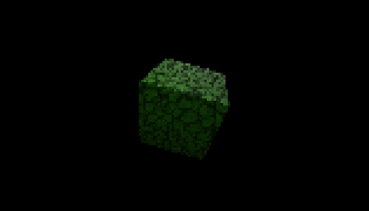

# alasgar
alasgar is a pure nim game engine based on OpenGL. The main reason to start developing a new game engine, was to learn graphics programming (first challenge) using nim programming language (second challenge). You can write the whole game logic and also shaders in nim. It supports a few platforms including mobile, web, and desktop. It performs well in the performance tests. It is the journey of a backend/system developer through graphics/game programming.

# Platforms
 - FreeBSD (tested on 14.0, probably works also on NetBSD and OpenBSD also)
 - Linux (tested on various distros like void and arch)
 - Windows (tested on Windows 11)
 - Android (tested on some old samsung devices)
 - WebAssembly (tested on firefox and chrome)
 - macOS (tested on macOS Ventura)
 - iOS (not supoorted)

## Experimental game engine
alasgar is a basic game engine, and it is limited, so it is not ready for production use.

## Installation
```bash
nimble install alasgar
```
or simply the latest version:
```bash
nimble install https://github.com/abisxir/alasgar
```

## Quick start
```bash
git clone https://github.com/abisxir/alasgar.git
cd alasgar/examples
nim c -r text.nim
```

Table of Contents
=================

* [Window and scene creation](#window-and-scene-creation)  
* [Dependencies](#deps)

Window and scene creation
=========================
```nim
import alasgar

proc load() = discard
proc draw() = discard
proc cleanup() = discard

# Creates a window named Step1
window(800, 600, "Step1", load, draw, cleanup)
```

As you may familiar with the concept, we created a window and passed three functions.
The engine, will create a window and will call our functions in this order:

1. load: only once when window is created.
2. draw: on each frame, as long as game runs.
3. cleanup: when applications goes done, so will let the application to release the resources.

```bash
nim c -r main.nim
```

Check the [example](https://abisxir.github.io/alasgar/step1/build) here.

When you create a window by default it runs in window mode, you can easily enable fullscreen mode:
```nim
# Creates a window named Step1 and enables fullscreen mode.
window(800, 600, "Step1", load, draw, cleanup, fullscreen=true)
```

Dependencies
============
## sokol
The engine relies on [sokol](https://github.com/floooh/sokol-nim) for window creation and input handling but does not use anything further. When the window is created, it creates the OpenGL context and works directly on top of OpenGL, not sokol functions and paradigms for rendering.
## miniaudio
For audio, it does not use sokol extensions, instead it depends on [miniaudio](https://miniaud.io/).
